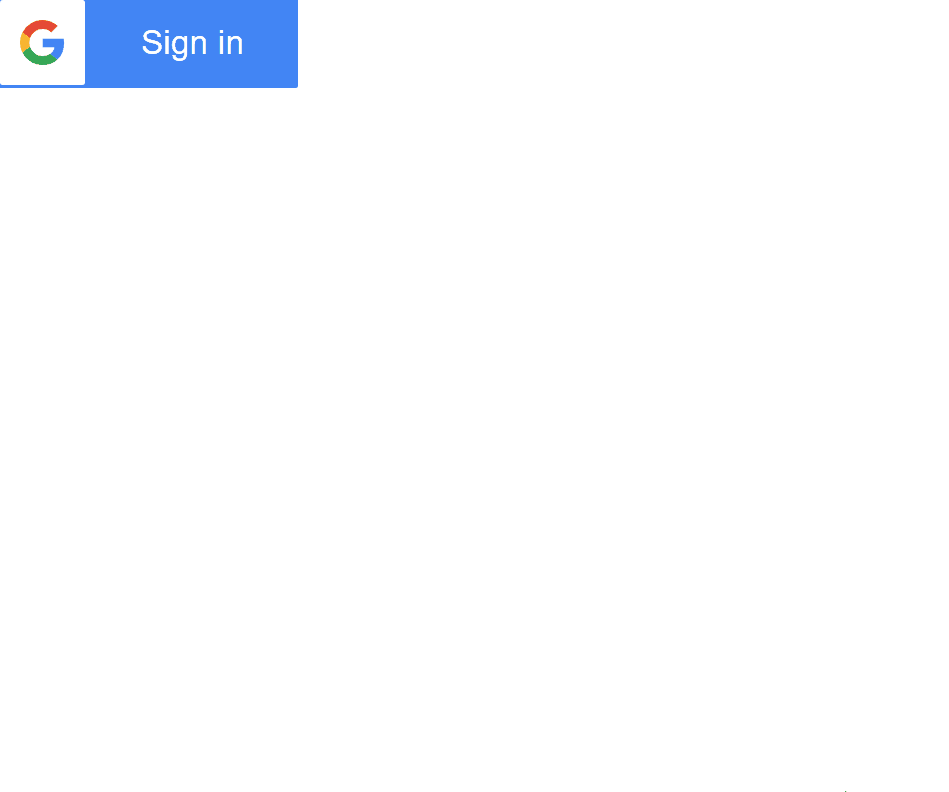

# Elm Google Sign In
This library makes it easy to insert an official "Sign in with Google" button onto your webpage.



## Features
- **Encapsulated**: Google's API is only loaded in iframes,
and these iframes are only active for the shortest amount of time possible:
while the button is on the screen and for a short amount of time after the `googleSignOut` event is sent.
This means that any data collection that Google attempts to do is as restricted as is possible when using Google's APIs.
- **Idiomatic**: Pass a `msg` constructor to the `onSignIn` attribute for the Google sign in button
just like you'd pass a `msg` constructor to the `onClick` attribute on a normal button.
Sign out from anywhere in your application by issuing a `Cmd`.

## idToken
Google is very explicit in reminding you to use `idToken`s
when verifying your clients on your server through this API,
not any other form of identification.

This will work best with other Google services and is much more secure.

[More information and official Google rationale can be found here](https://developers.google.com/identity/sign-in/web/backend-auth),
which is also just a great read if you're setting up a backend for your signed in Google users.

Through this package, the `idToken`s can be found as a field on the `Profile` record,
which is passed to the function passed to the `GoogleSignIn.onSignIn` attribute,
which you can pass to a `GoogleSignIn.view` when rendering your Google sign in button.

## Sessions
If the user closes your page and then opens it again without logging out,
as soon as the button is rendered on the screen the `onSignIn` event is fired.
This happens due to the way Google designed the button.

## ClientId
Not to be confused with the `idToken` discussed above,
which is provided to you by Google so you can make sure your users are legitimate,
Google also requires you to provide a token which legitimizes you and your application.

You can get one of these tokens
[on this official google page](https://developers.google.com/identity/sign-in/web/sign-in).
When you're supplying domains that should work with this `ClientId`
it may be desirable to supply `http://localhost:8000` and `http://localhost:8080` as valid addresses
so that you can still authenticate with Google when your site is hosted locally for development purposes.
Keep in mind that you can enable, disable, and tweak these tokens and permissions at any time
(even after their creation) by returning to that site.

The scopes you pick here will also impact whether or not the `email` field is present on the `Profile`
records your `GoogleSignIn.onSignIn` handler is passed:
if you don't specify the need for the email scope in Google's project configuration GUI,
the `email` field will always be `Nothing` instead of, for example, `Just "ced@example.com"`

The token Google gives you is very long, like, for example, 
`421355382458-d5e1j581a9atnin2t9vfsbd62fkqkmie.apps.googleusercontent.com`.
Keep in mind that when constructing your `ClientId` with `GoogleSignIn.Id`,
you need only supply the portion of the id leading up to the first `.`,
so in this case, `421355382458-d5e1j581a9atnin2t9vfsbd62fkqkmie`.

## Shortcomings
Currently, minimal aesthetic configuration of the sign in buttons is possible,
although Google allows fairly extensive customization including light and dark themes for the buttons.
Currently, the dark theme for the button is enabled by default and inconfigurable.
PRs are welcome. More information on the possible customization of the buttons that is yet
to be wrapped by this package can be found [here](https://developers.google.com/identity/sign-in/web/build-button).

## Using this in pure Elm projects
Overall, not much should change.
Because this package needs to use JS to bind Google's APIs to Elm,
you need to have webpack or some other tool like parcel to bundle the JS with your Elm code.
The example uses webpack.
You can also bundle in CSS, HTML, Rust, etc. this way, and run tools like Babel over your JS code.
Webpack will also minify and obsfuscate in production where possible.
Bring `index.js`, `package.json`, and both `webpack.*.config.js` files into your project.
If your application's `Main.elm` is in `<project>/src/Main.elm`, then drop all of these files right in `<project>/`.
If your application's main file isn't `Main.elm`, you may need to
change the `import { Elm } from './src/Main.elm';` line in `index.js`.
`npm run serve` is the command to run for development,
whereas `npm run build` will fill the `dist/` directory with files you can serve from any static web host for production.

## My backend isn't in Node, do I still need all of this npm stuff?
Webpack simply bundles together your front end code. It uses [node.js](https://nodejs.org) but it isn't a backend.
The dev-server `npm run serve` uses is completely optional, you can also use any other static file host during development.
You can use the static files `npm run build` produces with any backend.

## Minimal code example
Accompanying JS and CSS for this example, as well as webpack configurations,
can be found in the `/example` directory.
Simply cloning the example and running `npm run serve` should be sufficient.
Pillaging the accompanying webpack configuration is highly encouraged.
You can run the example from scratch (ensure git, npm, and Elm are installed) with
```
git clone https://github.com/cedric-h/elm-google-sign-in.git
cd elm-google-sign-in
cd example
npm install
npm run serve
```
Main.elm
```Elm
port module Main exposing (..)

import Browser
import GoogleSignIn
import Html exposing (Html, button, div, text)
import Html.Events exposing (onClick)
import Json.Encode as E


-- MAIN


main =
    Browser.element
        { init = init
        , update = update
        , subscriptions = subscriptions
        , view = view
        }


id : GoogleSignIn.ClientId
id =
    GoogleSignIn.Id "421355382458-d5e1j581a9atnin2t9vfsbd62fkqkmie"


port googleSignOut : E.Value -> Cmd msg


port googleSignOutComplete : (E.Value -> msg) -> Sub msg


-- MODEL


type alias Model =
    Maybe String


init : () -> ( Model, Cmd msg )
init () =
    ( Nothing, Cmd.none )


-- UPDATE


type Msg
    = SignIn GoogleSignIn.Profile
    | BeginSignOut
    | SignOutComplete


update : Msg -> Model -> ( Model, Cmd Msg )
update msg model =
    case msg of
        SignIn profile ->
            ( Just profile.name, Cmd.none )

        BeginSignOut ->
            ( model, googleSignOut <| GoogleSignIn.encodeId id )

        SignOutComplete ->
            ( Nothing, Cmd.none )


-- SUBSCRIPTIONS


subscriptions : Model -> Sub Msg
subscriptions model =
    googleSignOutComplete (\a -> SignOutComplete)


-- VIEW


view : Model -> Html Msg
view model =
    div []
        [ case model of
            Just name ->
                div []
                    [ div [] [ text ("Welcome, " ++ name) ]
                    , div [] [ button [ onClick BeginSignOut ] [ text "Sign Out" ] ]
                    ]

            Nothing ->
                GoogleSignIn.view
                    [ GoogleSignIn.onSignIn SignIn
                    , GoogleSignIn.idAttr id
                    ]
        ]
```
